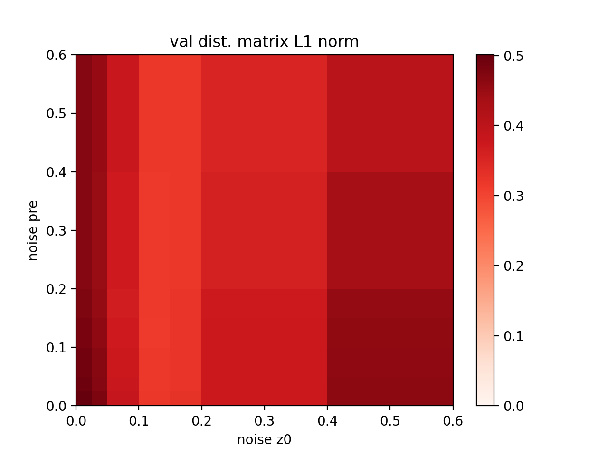

# AEDR
Auto Encoder Dimensionality Reduction

## Summary
Aim: assess the suitability of autoencoders (AE) for dimensionality reduction to 2D.\
For that purpose, several synthetic datasets were generated based on 2D clusters transformed to higher dimensionality using linear or non-linear methods. An AE class was defined in torch. The AEs were then trained with various parameters for 300 epochs and evaluated on a separate validation set.\
Of particular interest was the effect of noise on the robustness of the compression, measured by the deviations of distance matrices in the original dimensionality vs the 2D representation of the validation data.\
\
This project was a dead-end offshoot of a larger project. For this reason, the effect of different encoder and decoder structures, datasets, additional loss functions etc. were not investigated in depth.

## Result
A short investigation into the effect of noise added to the input data ("pre-noise") or at the level of the bottleneck dimension ("z0-noise") showed that a small amount of z0-noise was beneficial to the representation, whereas the pre-noise barely had an effect, at least in the same value range.\

## Setup
In the repository, one particular dataset is already provided as example.\
To generate other or more data and visualise the original 2D representation, run 
`generate_data.py`. A screen of both noise types can be executed from `main.py`. The file `run.py` defines the code for running one run, `utils.py` the AE class and various loss functions.
